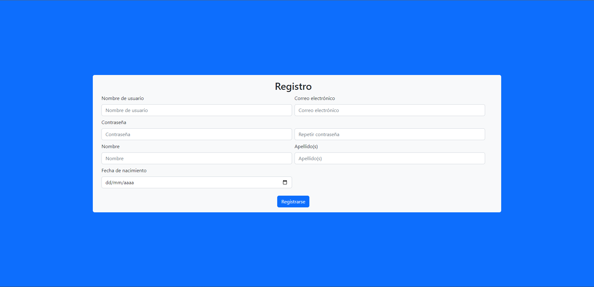
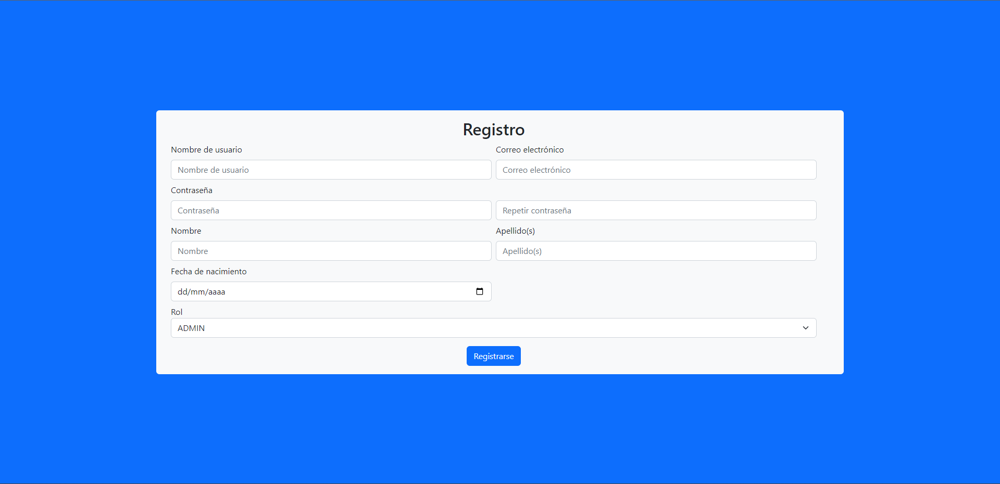
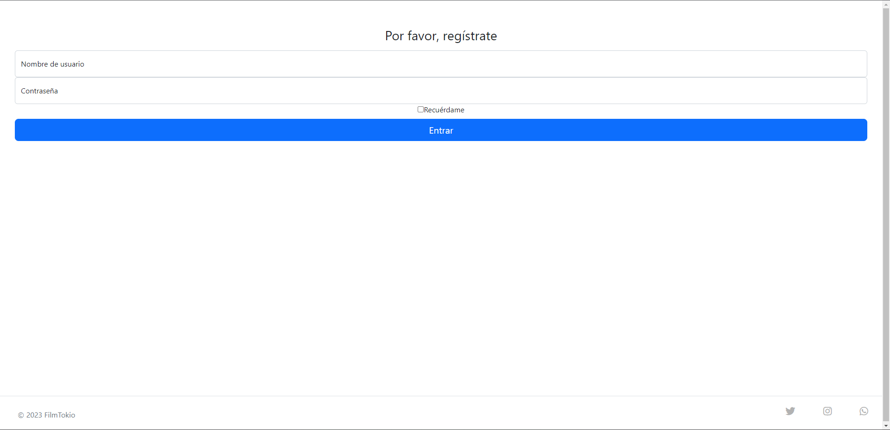
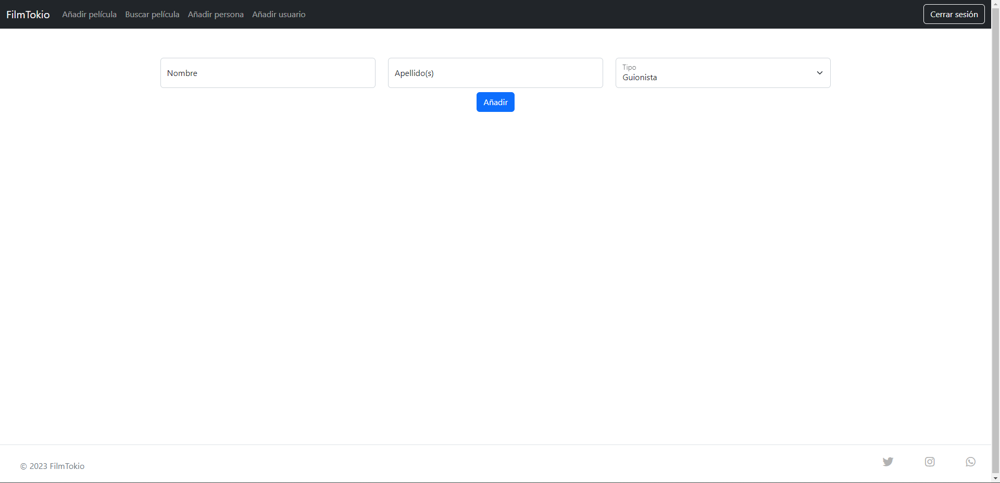
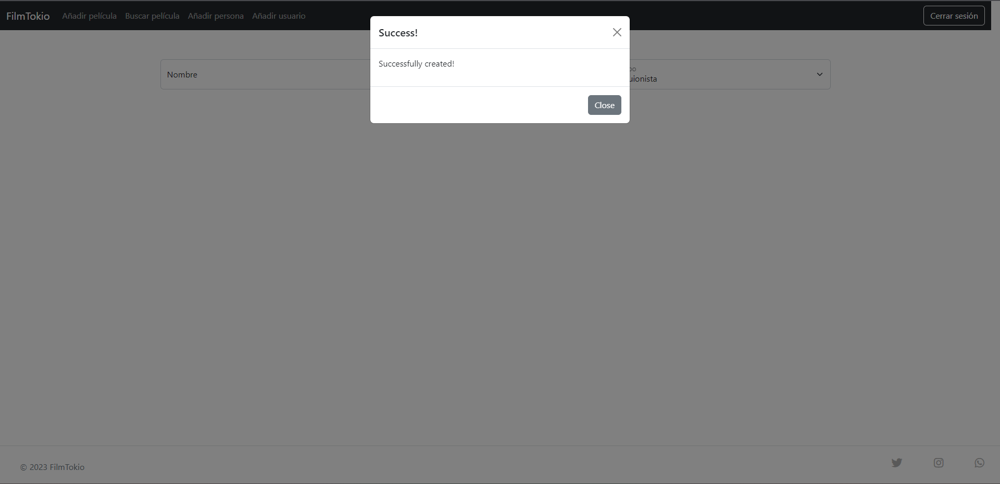

# Proyecto Final Tokio School

## Introducción

Este documento es la explicación del Proyecto Final del curso de "Especialización Framework Spring" de Tokio School.

Todo el código del proyecto completo se encuentra en
este [GitHub repository](https://github.com/carloshilo/FilmoTokio/).

En vez de incluir grabaciones de pantalla, proveeré enlaces al código en el repository de GitHub. También
Proporcionaré en el propio documento fragmentos de código que requieren más explicación.

## Sumario

<!-- TOC -->

- [Proyecto Final Tokio School](#proyecto-final-tokio-school)
    - [Introducción](#introducci%C3%B3n)
    - [Sumario](#sumario)
    - [Estructura del Programa](#estructura-del-programa)
    - [Usuario](#usuario)
        - [Objeto de Dominio](#objeto-de-dominio)
        - [Creación de Usuario](#creaci%C3%B3n-de-usuario)
            - [CreateUserDTO](#createuserdto)
            - [signup.html](#signuphtml)
          - [UserController](#usercontroller)
          - [UserService](#userservice)
              - [create(CreateUserDTO)](#createcreateuserdto)
      - [Login](#login)
          - [SecurityConfig](#securityconfig)
          - [LoginSuccessHandler](#loginsuccesshandler)
  - [Personas](#personas)
      - [PersonController.addPerson](#personcontrolleraddperson)
      - [PersonService.addPerson(Person person)](#personserviceaddpersonperson-person)

<!-- /TOC -->

## Estructura del Programa

La estructura final del programa es:

```
.
├── mvn
├── pom.xml
├── README.md
├── readme-pics
└── src
    ├── main
    │   ├── java
    │   │   └── com
    │   │       └── tokioschool
    │   │           ├── filmotokio
    │   │           │   ├── configuration
    │   │           │   │   ├── ValidationMessageConfig.java
    │   │           │   │   └── WebConfig.java
    │   │           │   ├── controller
    │   │           │   │   ├── api
    │   │           │   │   │   └── ApiController.java
    │   │           │   │   ├── FilmController.java
    │   │           │   │   ├── IndexController.java
    │   │           │   │   ├── PersonController.java
    │   │           │   │   └── UserController.java
    │   │           │   ├── domain
    │   │           │   │   ├── annotation
    │   │           │   │   │   └── SamePassword.java
    │   │           │   │   ├── dto
    │   │           │   │   │   ├── CreateUserDTO.java
    │   │           │   │   │   ├── FilmDTO.java
    │   │           │   │   │   ├── LoginDTO.java
    │   │           │   │   │   ├── PasswordDTO.java
    │   │           │   │   │   └── ReviewDTO.java
    │   │           │   │   ├── enums
    │   │           │   │   │   └── TypePerson.java
    │   │           │   │   ├── validator
    │   │           │   │   │   └── SamePasswordValidator.java
    │   │           │   │   ├── Film.java
    │   │           │   │   ├── Person.java
    │   │           │   │   ├── Review.java
    │   │           │   │   ├── Role.java
    │   │           │   │   ├── Score.java
    │   │           │   │   └── User.java
    │   │           │   ├── exception
    │   │           │   │   ├── FilmNotFoundException.java
    │   │           │   │   ├── ImageUploadException.java
    │   │           │   │   ├── ReviewAlreadyExistsException.java
    │   │           │   │   ├── UnauthorizedException.java
    │   │           │   │   ├── UsernameAlreadyExistsException.java
    │   │           │   │   └── UserNotFoundException.java
    │   │           │   ├── FilmoTokioApplication.java
    │   │           │   ├── properties
    │   │           │   │   └── FileDirectoryProperties.java
    │   │           │   ├── repository
    │   │           │   │   ├── FilmRepository.java
    │   │           │   │   ├── PersonRepository.java
    │   │           │   │   ├── ReviewRepository.java
    │   │           │   │   ├── RoleRepository.java
    │   │           │   │   ├── ScoreRepository.java
    │   │           │   │   └── UserRepository.java
    │   │           │   ├── security
    │   │           │   │   ├── service
    │   │           │   │   │   └── JpaUserDetailsService.java
    │   │           │   │   ├── LoginSuccessHandler.java
    │   │           │   │   └── SecurityConfig.java
    │   │           │   ├── service
    │   │           │   │   ├── FileService.java
    │   │           │   │   ├── FilmService.java
    │   │           │   │   ├── impl
    │   │           │   │   │   ├── FileServiceImpl.java
    │   │           │   │   │   ├── FilmServiceImpl.java
    │   │           │   │   │   ├── PersonServiceImpl.java
    │   │           │   │   │   ├── ReviewServiceImpl.java
    │   │           │   │   │   ├── ScoreServiceImpl.java
    │   │           │   │   │   ├── RoleServiceImpl.java
    │   │           │   │   │   └── UserServiceImpl.java
    │   │           │   │   ├── PersonService.java
    │   │           │   │   ├── ReviewService.java
    │   │           │   │   ├── RoleService.java
    │   │           │   │   ├── ScoreService.java
    │   │           │   │   └── UserService.java
    │   │           │   └── utils
    │   │           │       ├── Constants.java
    │   │           │       ├── FileUtils.java
    │   │           │       └── StringUtil.java
    │   │           └── filmotokiobatch    
    │   │               ├── config
    │   │               │   └── JobBatchConfiguration.java
    │   │               ├── items
    │   │               │   ├── FilmItemProcessor.java
    │   │               │   ├── FilmLineAggregator.java
    │   │               │   └── FilmMapper.java
    │   │               └── listeners
    │   │                   ├── MigrateFilmStartListener.java
    │   │                   └── MigrateFilmWriteListener.java
    │   └── resources
    │       ├── application.yml
    │       ├── films.csv
    │       ├── import.sql
    │       ├── static
    │       │   ├── css
    │       │   │   └── style.css
    │       │   └── images
    │       │       ├── default-profile.png
    │       │       ├── peliculas
    │       │       └── Tokio.svg
    │       └── templates
    │           ├── error.html
    │           ├── film.html
    │           ├── fragments
    │           │   ├── footer.html
    │           │   ├── head.html
    │           │   ├── header.html
    │           │   └── personCreatedModal.html
    │           ├── index.html
    │           ├── login.html
    │           ├── new-film.html
    │           ├── new-person.html
    │           ├── search-film.html
    │           ├── searched-film.html
    │           └── signup.html
    └── test
        ├── java
        │   └── com
        │       └── tokioschool
        │           ├── filmotikio
        │           │   └── FilmoTokioApplicationTests.java
        │           └── filmotikiobatch
        │               └── FilmoTokioBatchApplicationTests.java
        └── resources
            ├── application.yml
            ├── films.csv
            └── test.sql
```

## Usuario

El Usuario es la fundación de nuestra app. Casi todos los datos, de `Film`, `Score` y `Review` pertenecen a un `User`.
Son los usuarios los que añaden los datos a la app.

### Objeto de Dominio

[User.java](https://github.com/carloshilo/FilmoTokio/blob/main/src/main/java/com/tokioschool/filmotokio/domain/User.java)

Como se puede ver, decidí implementar el `interface` de `Serializable` con el objeto de dominio `User`. Esto permitirá
que se puedan serializar instancias de `User` y así ser almacenadas en la base de datos o transferidas entre diferentes
componentes de la aplicación. Además, al utilizar esta interfaz me aseguro que `User` es compatible con otros
componentes que requieran que los objetos que manejan sean serializables, como el caso de la sesión de usuario.

Utilicé las anotaciones de `@Getter`, `@Setter`, `@Builder`, `@NoArgsConstructor` y `@AllArgsConstructor` para generar
automáticamente los getters, setters y constructores de la clase, reduciendo el código repetitivo y haciendo que sea más
fácil de leer y mantener.

Además, también utiliza las anotaciones de `@OneToMany` y `@ManyToOne`. La anotación `@OneToMany` sirve para definir la
relación entre un `User` y sus `Film`, `Review` y `Score` en la base de datos. Esta anotación indica que un usuario
puede tener muchas películas, revisiones y puntuaciones en la base de datos. La anotación `@ManyToOne` sirve para
definir la relación entre un `User` y su `Role` en la base de datos. Esta anotación indica que un usuario puede tener un
rol y que muchos usuarios pueden tener el mismo rol en la base de datos.

### Creación de Usuario

* [index.html](https://github.com/carloshilo/FilmoTokio/blob/main/src/main/resources/templates/index.html)
* [head.html](https://github.com/carloshilo/FilmoTokio/blob/main/src/main/resources/templates/fragments/head.html)
* [header.html](https://github.com/carloshilo/FilmoTokio/blob/main/src/main/resources/templates/fragments/header.html)
* [footer.html](https://github.com/carloshilo/FilmoTokio/blob/main/src/main/resources/templates/fragments/footer.html)

Al llegar a la página inicial de la plataforma FilmTokio, encontramos en el encabezado de la página un botón llamado '
Registro' para crear un nuevo usuario.


En el archivo `header.html`, se puede observar que si el usuario no ha iniciado sesión, se muestran los botones para
iniciar sesión ('Iniciar sesión') o registrarse ('Registro').

```
<li sec:authorize="!isAuthenticated()">
    <a th:class="'btn btn-outline-light'" th:href="@{/login}" th:text="'Inicio sesión'"></a>
</li>
<li sec:authorize="!isAuthenticated()">
    <a th:class="'btn btn-outline-light'" th:href="@{/users/signup}" th:text="'Registro'"></a>
</li>
```

Al hacer clic en el botón de registro, se llama al método `@GetMapping` en el controlador `UserController`. Este método
crea un nuevo objeto de tipo `CreateUserDTO` y lo agrega al modelo de `signup.html`. También carga el modelo con
los `Role` disponibles en caso de que sea un `Admin` que quiera crear un nuevo `User`.

```
@GetMapping("/signup")
  public String signup(Model model) {
    model.addAttribute("model", new CreateUserDTO());
    model.addAttribute("roles", roleService.findAll());
    return "signup";
  }
```

#### CreateUserDTO

* [CreateUserDTO.java](https://github.com/carloshilo/FilmoTokio/blob/main/src/main/java/com/tokioschool/filmotokio/domain/dto/CreateUserDTO.java)
* [PasswordDTO.java](https://github.com/carloshilo/FilmoTokio/blob/main/src/main/java/com/tokioschool/filmotokio/domain/dto/PasswordDTO.java)

Decidí utilizar objetos DTO para la creación y actualización de usuarios con el fin de verificar las contraseñas.
Además, sólo es necesario incluir los campos necesarios para crear o actualizar un objeto `User` en lugar de incluir
todos los campos.

El objeto `CreateUserDTO` extiende la clase `PasswordDTO`:

```
@Data
@AllArgsConstructor
@NoArgsConstructor
public class CreateUserDTO extends PasswordDTO {

  @Serial
  private static final long serialVersionUID = -5659535844794150168L;

  private String username;
  private String name;
  private String surname;
  private String email;
  private Role role;

  @DateTimeFormat(style = "yyyy-MM-dd", pattern = "yyyy-MM-dd")
  @JsonFormat(pattern = "yyyy-MM-dd")
  private Date birthDate;

}
```

El `PasswordDTO` (junto a la anotación de `@SamePassword`) se utiliza para verificar que las dos contraseñas ingresadas
por el usuario nuevo son iguales. Si no son iguales, el campo `confirmPassword` se establece como `null` y esto activa
el sistema de validación que vincula el campo con la anotación  `@NotNull(message = "{field.password.match}")`. Todos los mensajes de validación están configurados por el objeto de `@Configuration`
de `ValidationMessageConfig` ([GitHub](https://github.com/carloshilo/FilmoTokio/blob/main/src/main/java/com/tokioschool/filmotokio/configuration/ValidationMessageConfig.java)).

#### signup.html

* [signup.html](https://github.com/carloshilo/FilmoTokio/tree/main/src/main/resources/templates/signup.html)

La página tiene el formulario para crear un nuevo `User`.



```
<form th:action="@{/users/signup}" th:method="post" th:object="${model}">
```

Si es un `Admin` y quieres crear un nuevo `User`, también se mostrará la opción de elegir los `Role` del usuario nuevo:



```
<div class="col" sec:authorize="hasAuthority('ADMIN')">
    <label for="role" th:text="'Rol'"></label>
    <select class="form-select" id="role" th:field="*{role}">
        <option th:each="role : ${roles}" th:text="${role.name}"
                th:value="${role.id}"></option>
    </select>
</div>
```

#### UserController

* [UserController.java](https://github.com/FilmoTokio/blob/main/src/main/java/com/tokioschool/filmotokio/controller/UserController.java)

Al enviar los datos del nuevo usuario al servidor, se llama al método POST `signup()` del `UserController`:

```
@PostMapping("/signup")
  public String signup(@ModelAttribute @Valid CreateUserDTO createUserDTO, BindingResult result,
      Model model,
      SessionStatus status) {

    if (result.hasErrors()) {
      model.addAttribute("model", createUserDTO);
      model.addAttribute("roles", roleService.findAll());
      return "signup";
    }
    userService.create(createUserDTO);
    status.setComplete();
    return "redirect:/index";
  }
``` 

Este método tiene 6 pasos:
1. Recibe los datos del nuevo usuario a través del objeto `createUserDTO` de la clase `CreateUserDTO`.
2. Valida los datos del usuario utilizando la anotación `@Valid` y el objeto `BindingResult`.
3. Si hay errores de validación, agrega el objeto `createUserDTO` y una lista de roles a un modelo de vista `model` y devuelve la vista "signup" para que el usuario corrija los errores.
4. Si no hay errores de validación, llama al método `create()` del servicio de usuario `userService` para crear un nuevo `User` utilizando los datos del objeto `createUserDTO`.
5. Marca el estado de la sesión como completo utilizando el objeto `SessionStatus`.
6. Redirige al usuario a la página de inicio "index" para que inicie sesión.

#### UserService

* [UserServiceImpl.java](https://github.com/carloshilo/FilmoTokio/blob/main/src/main/java/com/tokioschool/filmotokio/service/impl/UserServiceImpl.java)

##### create(CreateUserDTO)

* [UserRepository.java](https://github.com/carloshilo/FilmoTokio/blob/main/src/main/java/com/tokioschool/filmotokio/repository/UserRepository.java)

```
@Override
  public User create(CreateUserDTO userDTO) {
    if (userRepository.findByUsername(userDTO.getUsername()).isPresent()) {
      throw new UsernameAlreadyExistsException("Username not available");
    }
    BCryptPasswordEncoder encoder = new BCryptPasswordEncoder();
    User user = User.builder()
        .name(userDTO.getName())
        .surname(userDTO.getSurname())
        .username(userDTO.getUsername())
        .password(encoder.encode(userDTO.getPassword()))
        .email(userDTO.getEmail())
        .birthdate(userDTO.getBirthDate())
        .role(userDTO.getRole())
        .build();

    return userRepository.save(user);
  }
```

El método `create(CreateUserDTO userDTO)` tiene 6 pasos:

1. Verifica si el nombre de usuario proporcionado en el objeto `CreateUserDTO` ya existe en la base de datos mediante la invocación del método `userRepository.findByUsername(userDTO.getUsername()
2. Si el nombre de usuario ya existe, se lanza una excepción `UsernameAlreadyExistsException`. 
3. Si el nombre de usuario no existe, se crea una instancia de `BCryptPasswordEncoder` para cifrar la contraseña del usuario. 
4. Se crea una nueva instancia de `User` utilizando el constructor de `User.builder()` y se establecen los valores de los campos utilizando los valores proporcionados en el objeto `CreateUserDTO` y la contraseña cifrada obtenida del objeto `BCryptPasswordEncoder`. 
5. Se guarda el objeto `User` recién creado en la base de datos mediante la invocación del método `userRepository.save(user)`. 
6. Finalmente, se devuelve el objeto `User` recién creado.

### Login

* [login.html](https://github.com/carloshilo/FilmoTokio/blob/main/src/main/resources/templates/login.html)

Al hacer clic en el enlace 'Inicio sesión' para iniciar sesión, el método GET `login(Model model)` del `UserController` devuelve la página `login.html` que contiene el formulario para ingresar el nombre de usuario y la contraseña de `User`.



#### SecurityConfig

* [SecurityConfig.java](https://github.com/FilmoTokio/blob/main/src/main/java/com/tokioschool/filmotokio/security/SecurityConfig.java)

La clase `SecurityConfig` es donde se configura el método de iniciar sesión.

```
@Bean
  public SecurityFilterChain filterChain(HttpSecurity http) throws Exception {
    http.csrf().disable()
        .authorizeRequests()
        .antMatchers("/", "/index", "/users/signup",
            "/swagger-resources",
            "/swagger-resources/**",
            "/swagger-ui.html",
            "/webjars/**",
            "/v3/api-docs/**",
            "/swagger-ui/**", "/api/**").permitAll()
        .anyRequest().authenticated()
        .and()
        .formLogin()
        .successHandler(successHandler)
        .loginPage("/login").permitAll()
        .and()
        .logout()
        .logoutUrl("/logout")
        .logoutSuccessUrl("/")
        .permitAll()
        .and()
        .exceptionHandling()
        .accessDeniedPage("/error_403");

    return http.build();
  }
```

Ignorando las partes del método que pertenecen al tema de RESTful API y autenticación JWT, se puede ver que mientras varios paths están abiertos a los usuarios no autenticados, se configura la autenticación del usuario mediante formulario.

#### LoginSuccessHandler

* [LoginSuccessHandler.java](https://github.com/carloshilo/FilmoTokio/blob/main/src/main/java/com/tokioschool/filmotokio/security/LoginSuccessHandler.java)

La clase `LoginSuccessHandler.java`, que extiende `SimpleUrlAuthenticationSuccessHandler` de Spring Security, se utiliza para manejar cuando el usuario inicie sesión exitosamente.

La clase tiene una dependencia del servicio `UserService`, que se inyecta a través del constructor mediante la anotación `@AllArgsConstructor` de Lombok. En el método `onAuthenticationSuccess()`, se crea un objeto `SessionFlashMapManager` para gestionar los mensajes flash, y se crea un objeto `FlashMap` que contiene el mensaje de éxito para el usuario.

Si el incio de sesión es correcta y el objeto no es nulo, se registra un mensaje en el registro de la aplicación y se obtiene el `User` correspondiente del servicio `UserService`. A continuación, se utiliza este `User` para actualizar su estado de conexión.

Finalmente, el mensaje de éxito se guarda en el `FlashMap` y se redirige al usuario a la página de inicio mediante la llamada a `super.onAuthenticationSuccess()`.

```
  @Override
  public void onAuthenticationSuccess(HttpServletRequest request, HttpServletResponse response,
      Authentication authentication) throws IOException, ServletException {

    var flashMapManager = new SessionFlashMapManager();
    var flashMap = new FlashMap();

    if (Objects.nonNull(authentication)) {
      log.info("User {} successfully logged in", authentication.getName());
      var user = userService.getByUsernameOrThrow(authentication.getName());
      userService.logged(user);
    }

    flashMap.put("success", "Hello " + authentication.getName() + ", you successfully logged in!");

    flashMapManager.saveOutputFlashMap(flashMap, request, response);

    super.onAuthenticationSuccess(request, response, authentication);
  }
```

## Personas

* [Person.java](https://github.com/carloshilo/FilmoTokio/blob/main/src/main/java/com/tokioschool/filmotokio/domain/Person.java)
* [TypePerson.java](https://github.com/carloshilo/FilmoTokio/blob/main/src/main/java/com/tokioschool/filmotokio/domain/enums/TypePerson.java)
* [PersonController.java](https://github.com/carloshilo/FilmoTokio/blob/main/src/main/java/com/tokioschool/filmotokio/controller/PersonController.java)
* [PersonServiceImpl.java](https://github.com/carloshilo/FilmoTokio/blob/main/src/main/java/com/tokioschool/filmotokio/service/impl/PersonServiceImpl.java)
* [PersonRepository.java](https://github.com/carloshilo/FilmoTokio/blob/main/src/main/java/com/tokioschool/filmotokio/repository/PersonRepository.java)
* [new-person.html](https://github.com/carloshilo/FilmoTokio/blob/main/src/main/resources/templates/new-person.html)

Las personas que crean las películas que interesan a nuestros usuarios, como directores, actores, etc., son una parte importante del dominio de nuestra plataforma.

Al llegar a la página para añadir una nueva persona, el usuario debe ingresar el nombre, apellidos y el tipo, que ya está determinado según el `TypePerson`.



### PersonController.addPerson()

Al enviar los datos de una nueva `Person` al servidor, estos llegan al método `addPerson` del controlador `userController`.

```
@PostMapping("/add")
  public String addPerson(@ModelAttribute @Valid Person person,
      BindingResult result,
      Model model,
      Principal principal) {
    if (result.hasErrors()) {
      log.error("Creation of Person {} failed because: {}", person,
          result.getAllErrors().toArray());
      model.addAttribute("person", person);
      return "new-person";
    } else {
      log.info("User {} added Person {}", principal.getName(), person);
      service.add(person);
      return "redirect:/person/add?person=created";
    }
  }
```

Este método tiene 5 pasos:
1. Recibe los datos del formulario de la nueva persona a través del objeto `@ModelAttribute @Valid Person person`. 
2. Realiza la validación de los datos recibidos mediante el objeto `BindingResult result`. 
3. Si hay errores en la validación, registra un mensaje de error en el registro y devuelve la vista "new-person" con el objeto `model` actualizado con los datos de la persona para corregir los errores. 
4. Si no hay errores en la validación, registra en el registro que el usuario ha añadido una nueva persona y llama al servicio `service.add(person)` para añadir la persona a la base de datos. 
5. Finalmente, redirige al usuario a la página de añadir una nueva persona con un mensaje de éxito a través de la sentencia `return "redirect:/person/add?person=created"`.



### PersonService.addPerson(Person person)

```
@Override
    public Person add(Person dto) {
        Person person = Person.builder()
                .name(dto.getName())
                .surname(dto.getSurname())
                .type(dto.getType())
                .build();

        log.info("Adding Person: {}", person);
        return personRepository.save(person);
    }
```

Este método solo guarda la `Person` nueva en el base de datos.